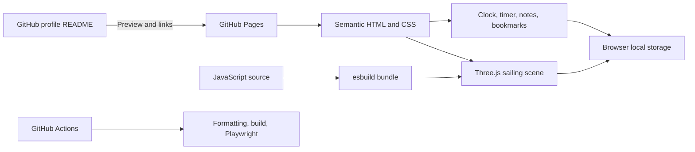

# The Sunny: a GitHub profile you can explore

[Play the live demo](https://nvs99bn.github.io/nvs99bn/#adventure) · [Read the visual case study](https://nvs99bn.github.io/nvs99bn/case-study.html) · [Source code](https://github.com/nvs99bn/nvs99bn)


## The problem

A decorative profile looked distinctive but gave visitors little insight into the person behind it. A large wanted poster took most of the first screen, while useful links were easy to miss. An image-based visitor counter could not distinguish the owner from other visitors.

The goal was to keep Văn Sơn’s One Piece interest, introduce his engineering work, and give visitors something useful to try.

## The experience

The README now leads with a readable engineering introduction and an actual game preview. Visitors can open a three-island voyage, steer a small pirate ship, and discover general information about backend work, interface work, and an applied AI direction. The same information and utilities are accessible without completing the game.

The companion page includes a focus timer, timezone clock, searchable bookmarks, and exportable notes. Notes, custom bookmarks and discovery progress are stored in the visitor’s browser. There is no visitor counter or sign-in requirement.

## Architecture



| Decision                                   | Why                                                                           | Tradeoff                                                                                  |
| :----------------------------------------- | :---------------------------------------------------------------------------- | :---------------------------------------------------------------------------------------- |
| Static GitHub Pages hosting                | Simple public deployment with no application server or runtime API keys.      | The game opens outside the README; the README cannot host its JavaScript.                 |
| Procedural Three.js scene                  | Ship, islands and landmarks are inspectable code; no remote model downloads.  | Stylized low-poly visuals, rather than detailed character assets.                         |
| Browser local storage                      | Notes work without an account and are not uploaded by the app.                | No cross-device sync. Clearing browser data removes local content; notes can be exported. |
| Direct island shortcuts and text summaries | Visitors can explore with keyboard or touch and can skip the game.            | The game is an optional discovery layer, not the only navigation.                         |
| Wall-clock timer deadline                  | Returning from a throttled background tab recalculates elapsed time.          | Reloading resets the timer; there is no guaranteed background notification.               |
| Remove the view badge                      | A proxy image request cannot identify the GitHub viewer or exclude the owner. | No claimed visitor total.                                                                 |

## Implementation details worth inspecting

- [World and interaction](src/game.js): procedural geometry, lighting, camera orbit, tap-to-sail, keyboard steering, shore collisions, island discovery and a WebGL fallback.
- [Utilities](app.js): wall-clock countdown, timezone formatting, local notes and text export, safe bookmark rendering and HTTP(S)-only URL validation.
- [Browser tests](tests/profile.spec.js): a complete voyage, saved progress, timer controls, notes persistence and export, bookmark validation, narrow screens and unavailable WebGL.
- [Automated checks](.github/workflows/quality.yml): run the build and browser tests for pushes and pull requests. The badge on the README links to actual run results.

## Verification and limits

The automated suite exercises user journeys in Chromium, including a narrow viewport and a reduced-motion setting. It uses a software WebGL renderer in CI. This does not establish performance on every phone, full screen-reader compatibility, or broad cross-browser support. No invented traffic, conversion, FPS or AI benchmark claims are included.

The first hosted run exposed a real timing problem: a 50 ms frame-delta cap slowed navigation below 20 FPS. The cap was raised to 250 ms, keeping movement steps smaller than an island radius. A deliberately slowed animation-loop test now covers the regression; this is a navigation-correctness check, not a rendering-performance benchmark.

Decorative scene motion pauses when reduced motion is requested. Rendering is skipped while the game is out of view or the document is hidden. The scene has a text-and-button fallback when WebGL is unavailable.

## Role and provenance

Văn Sơn set the direction, chose the One Piece theme, and reviewed the experience. Codex assisted with implementation, artwork generation, documentation and browser testing. This is an AI-assisted web and graphics project; it is not a trained AI model or evidence of model-training results.

The artwork is One Piece fan art. The ship and islands are original procedural meshes. Third-party code licensing is recorded in [THIRD_PARTY_LICENSES.txt](THIRD_PARTY_LICENSES.txt). No private repository names, code or business details are part of this case study.

## Run it yourself

```sh
npm ci
npm run build
python -m http.server 8765 --bind 127.0.0.1
```

Visit `http://127.0.0.1:8765`. See [DEVELOPMENT.md](DEVELOPMENT.md) for tests and maintenance.
