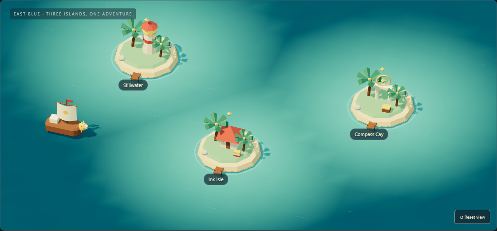
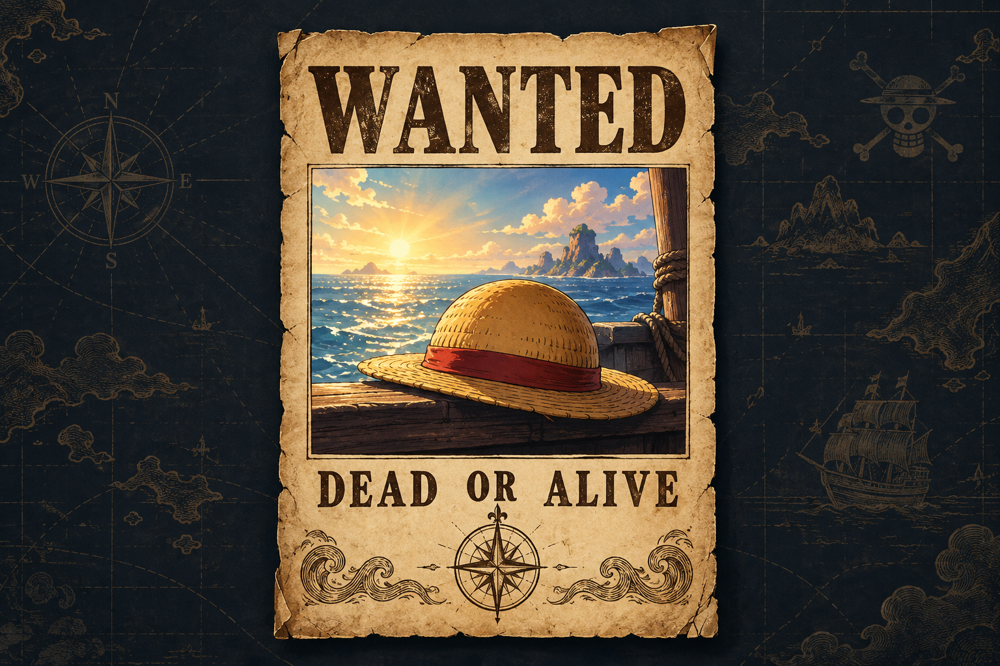

## Văn Sơn · Welcome aboard. ☀

**AI engineering focus. Full-stack product work. One Piece fan.**

I work across Python services and TypeScript interfaces, connecting APIs, improving everyday workflows, and testing the details that make software dependable.

**[⚓ Explore my work in 3D →](https://nvs99bn.github.io/nvs99bn/#adventure)** &nbsp; No sign-up. Keyboard and touch controls.

### What I bring aboard

**Python & integrations** — API connections, data transformations, and service configuration.

**TypeScript & interfaces** — React applications, dashboards, and multilingual workflows.

**Reliability & testing** — Regression tests, timezone handling, and clearer service diagnostics.

`Python` · `TypeScript` · `JavaScript` · `React` · `API integrations` · `Regression testing`

My direction is **applied AI engineering**: bringing intelligent tools into usable applications. My foundation is hands-on work across services and interfaces.

### A little personality, a playable world

**[Enter the 3D world →](https://nvs99bn.github.io/nvs99bn/#adventure)**

Discover my work and AI direction across three islands. Collect their stamps and earn your Explorer’s Seal.

- **[◷ Stillwater · Focus timer](https://nvs99bn.github.io/nvs99bn/#focus)** — Set aside 25 minutes. Take a breather.
- **[✎ Ink Isle · Captain’s notes](https://nvs99bn.github.io/nvs99bn/#notes)** — Capture an idea. Save or export it.
- **[⌖ Compass Cay · Log Pose](https://nvs99bn.github.io/nvs99bn/#log-pose)** — Search useful links. Add your favorites.

☀ The wanted poster behind this voyage

 

Play on the companion site, or go straight to a tool. Your notes and discoveries stay in your browser.
